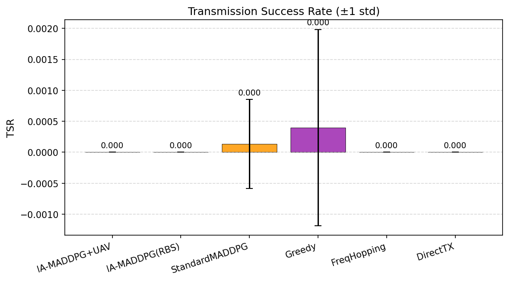

# Chương 5 — Kết quả mô phỏng và đánh giá

## 5.1 Bảng so sánh các phương pháp

| Phương pháp | Phần thưởng | TSR | Thông lượng (b/s/Hz) | Hiệu quả NL | D2D / RBS / UAV |
|---|---|---|---|---|---|
| **IA-MADDPG (UAV-relay)** | -0.474 ± 0.013 | 0.000 ± 0.000 | 0.007 | 0.000 | 0.00/0.40/0.60 |
| **IA-MADDPG (chỉ RBS)** | -0.465 ± 0.019 | 0.000 ± 0.000 | 0.015 | 15259.239 | 0.20/0.80/0.00 |
| **MADDPG tiêu chuẩn** | -0.453 ± 0.023 | 0.000 ± 0.001 | 0.011 | 0.000 | 0.40/0.20/0.40 |
| **Tham lam (Greedy)** | -0.451 ± 0.032 | 0.000 ± 0.002 | 0.027 | 27386.615 | 0.56/0.44/0.00 |
| **Nhảy tần ngẫu nhiên (FH)** | -0.388 ± 0.003 | 0.000 ± 0.000 | 0.003 | 2608.837 | 0.50/0.50/0.00 |
| **Truyền trực tiếp (DT)** | -0.383 ± 0.002 | 0.000 ± 0.000 | 0.001 | 1479.519 | 1.00/0.00/0.00 |

## 5.2 Hình ảnh kết quả

