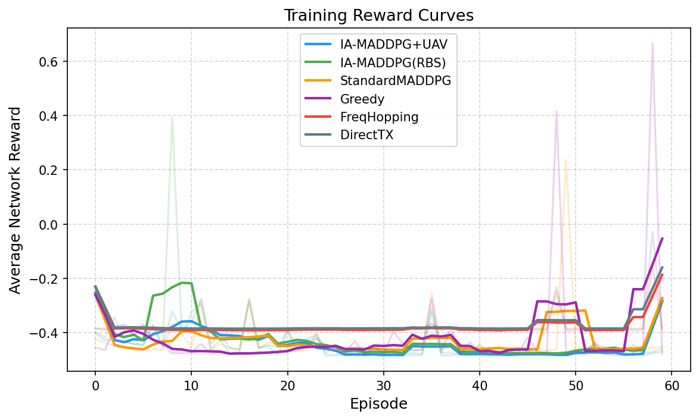
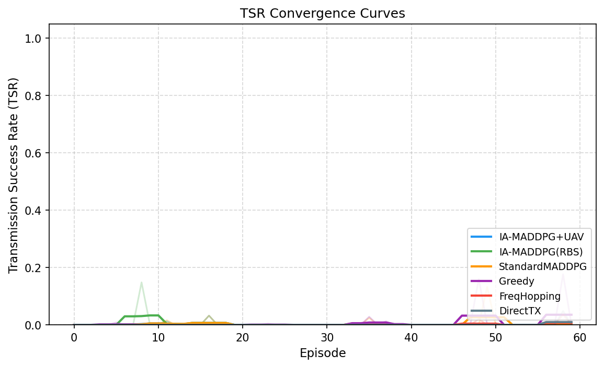
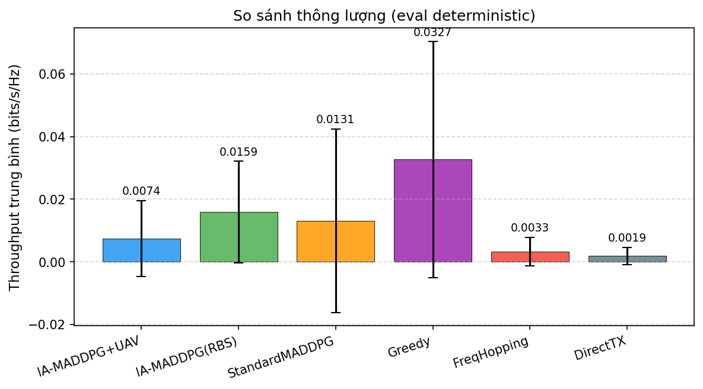
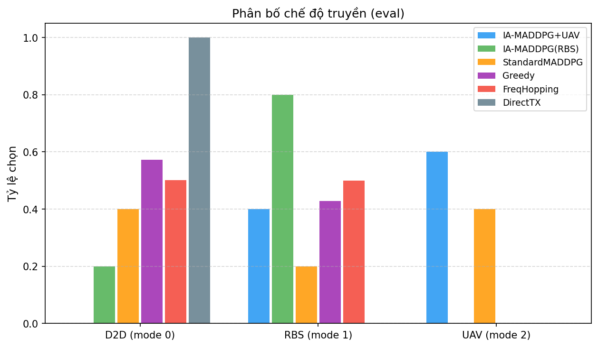
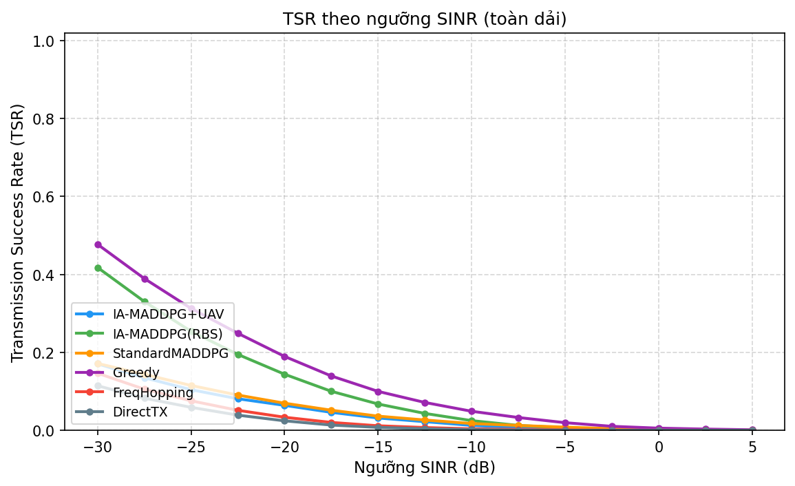
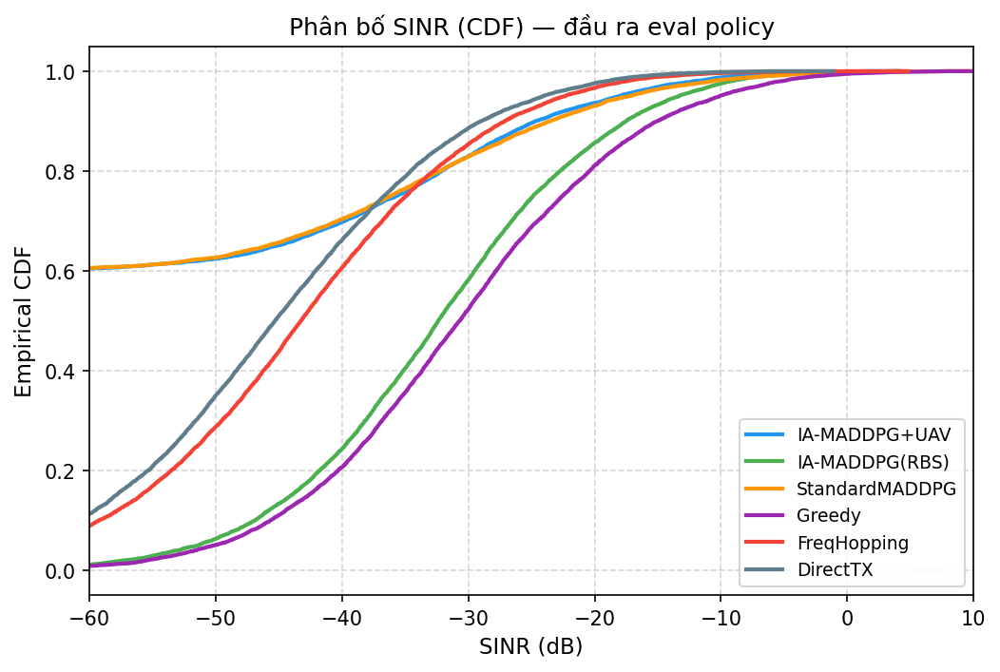
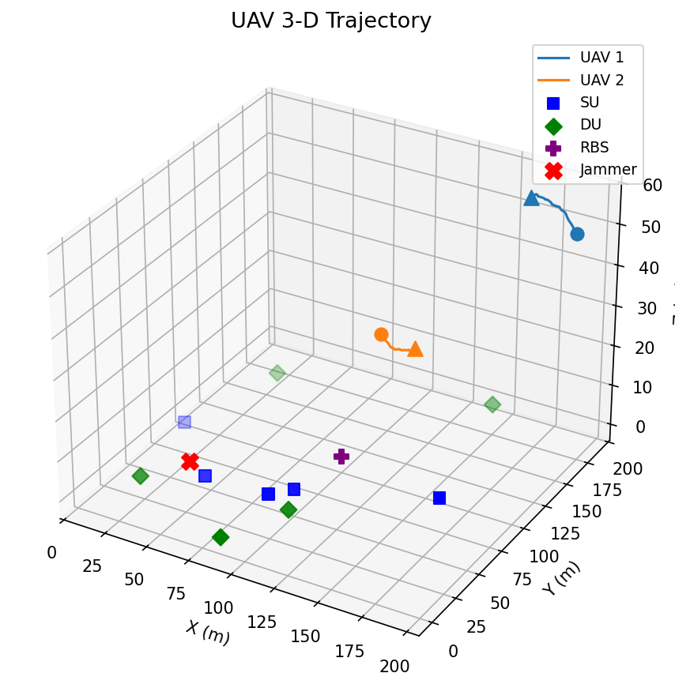
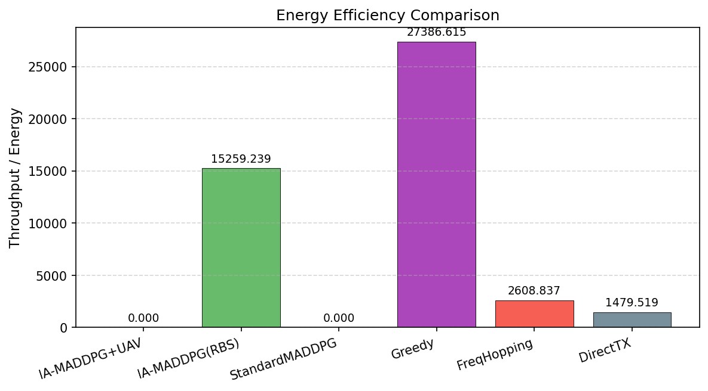
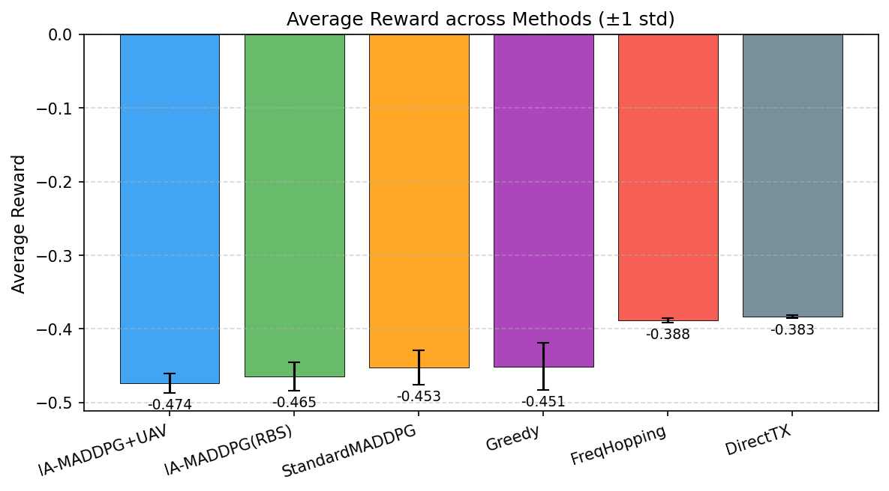

# Chương 5 — Kết quả mô phỏng và đánh giá

## 5.1 Bảng so sánh các phương pháp

| Phương pháp | Phần thưởng | TSR @-10 dB | Thông lượng (b/s/Hz) | Hiệu quả NL | D2D / RBS / UAV |
|---|---|---|---|---|---|
| **IA-MADDPG (UAV-relay)** | -0.474 ± 0.013 | 0.0126 | 0.0074 | 0.000 | 0.00 / 0.40 / 0.60 |
| **IA-MADDPG (chỉ RBS)** | -0.464 ± 0.018 | 0.0248 | 0.0159 | 15915.507 | 0.20 / 0.80 / 0.00 |
| **MADDPG tiêu chuẩn** | -0.450 ± 0.033 | 0.0174 | 0.0131 | 0.000 | 0.40 / 0.20 / 0.40 |
| **Tham lam (Greedy)** | -0.445 ± 0.042 | 0.0488 | 0.0327 | 32651.109 | 0.57 / 0.43 / 0.00 |
| **Nhảy tần ngẫu nhiên (FH)** | -0.388 ± 0.005 | 0.0037 | 0.0033 | 3303.966 | 0.50 / 0.50 / 0.00 |
| **Truyền trực tiếp (DT)** | -0.383 ± 0.003 | 0.0017 | 0.0019 | 1859.048 | 1.00 / 0.00 / 0.00 |

## 5.2 Hình ảnh kết quả

